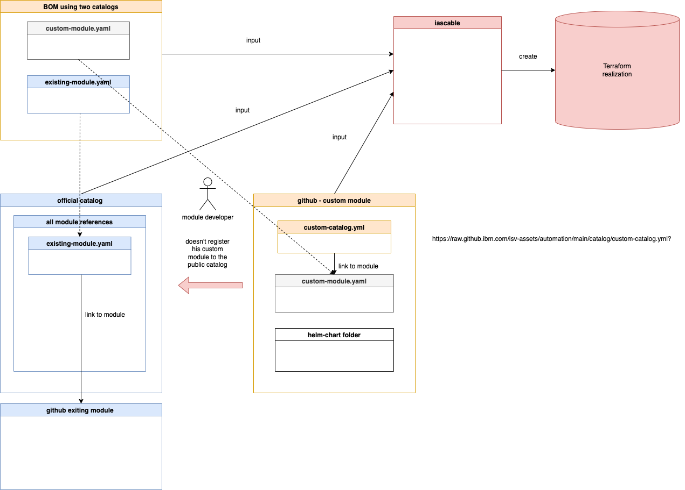

# gitops-create-software-everywhere-module

# Objective

The objective is to understand how to build new modules for the [`Technology Zone Accelerator Toolkit`](https://modules.cloudnativetoolkit.dev/).

# What does the project do?

This project does inspect the [template-terraform-gitops](https://github.com/cloud-native-toolkit/template-terraform-gitops) and needs to be seen in combination with the [gitops-verify-swagger-editor-example](https://github.com/thomassuedbroecker/gitops-verify-swagger-editor-example) outcome.

## Understand the [template-terraform-gitops](https://github.com/cloud-native-toolkit/template-terraform-gitops)

The [template-terraform-gitops](https://github.com/cloud-native-toolkit/template-terraform-gitops) is a part of the `How to` instructions of the [`Technology Zone Accelerator Toolkit`](https://modules.cloudnativetoolkit.dev/). 
The module covers the [GitOps topic](https://modules.cloudnativetoolkit.dev/#/how-to/gitops).

# Use the [template-terraform-gitops](https://github.com/cloud-native-toolkit/template-terraform-gitops) to create a module to deploy the guestbook example

## Perpare the environment

### a. Create a new GitHub repository based on the template

We will use later different catalogs here is a simplified view of the depencencies we will have later.



#### Step 1: Clone the project to your local computer

```sh
git clone https://github.com/cloud-native-toolkit/template-terraform-gitops
```

#### Step 2: Delete the `.git` folder in the cloned project to disconnect the git repository

#### Step 3: Rename the root folder of the project from `template-terraform-gitops` to `gitops-terraform-guestbook`

#### Step 4: Run the git init command in the `gitops-terraform-guestbook` folder

That will create a new `.git` folder.

```sh
git init
```

* Output

```sh
hint: Using 'master' as the name for the initial branch. This default branch name
hint: is subject to change. To configure the initial branch name to use in all
hint: of your new repositories, which will suppress this warning, call:
hint: 
hint:   git config --global init.defaultBranch <name>
hint: 
hint: Names commonly chosen instead of 'master' are 'main', 'trunk' and
hint: 'development'. The just-created branch can be renamed via this command:
hint: 
hint:   git branch -m <name>
Initialized empty Git repository in /Users/thomassuedbroecker/Downloads/dev/gitops-terraform-guestbook/.git/
```

#### Step 4: Execute the `git add --all` command

```sh
git add --all
```

#### Step 5: Create new github project [`gitops-terraform-guestbook`](https://github.com/thomassuedbroecker/gitops-terraform-guestbook) using `git commit`

```sh
git commit
```

* Interactive output:

It opens a `vi editor`. 
1. Enter `I`
2. Now you can insert some text `Init repo`.
3. Press `esc`
4. Press `:`
5. Insert `wq`

```sh

# Please enter the commit message for your changes. Lines starting
# with '#' will be ignored, and an empty message aborts the commit.
#
# On branch master
#
# Initial commit
#
# Changes to be committed:
#       new file:   .DS_Store
#       new file:   .github/.DS_Store
#       new file:   .github/release-drafter.yaml
#       new file:   .github/scripts/validate-deploy.sh
#       new file:   .github/scripts/validation-functions.sh
#       new file:   .github/workflows/manual-test-repo-delete.yaml
#       new file:   .github/workflows/notify.yaml
#       new file:   .github/workflows/publish-metadata.yaml
```

#### Step 6: Create a new empty GitHub repository with the name `gitops-terraform-guestbook`

#### Step 7: Connect to GitHub 

```sh
git branch -M main
USERNAME=YOUR_USERNAME
REPONAME=gitops-terraform-guestbook
git remote add origin git@github.com:$USERNAME/$REPONAME
```

#### Step 7: Push to the `master` branch

> If you don't have a [`ssh key`](https://docs.github.com/en/authentication/connecting-to-github-with-ssh/generating-a-new-ssh-key-and-adding-it-to-the-ssh-agent)

```sh
git push -u origin main
```

### 2. Configure the `guestbook` module 


#### Step 1:  Do some modification in the `main.tf` file

* Change `name = "my-module"` to `gitops-guestbook-module`
* First add `helm_guestbook = {// create entry}` to the `values_content = {}`. That entry will be used to create the values for the variables in the `values.yaml` file for the helm chart.
  
  Below you see the relevant code in the `main.tf` which does the copy later.

  ```sh
  resource null_resource create_yaml {
    provisioner "local-exec" {
      command = "${path.module}/scripts/create-yaml.sh '${local.name}' '${local.yaml_dir}'"

      environment = {
        VALUES_CONTENT = yamlencode(local.values_content)
      }
    }
  }
  ```

  These are the values we need to insert for our guestbook application as variables for the helm-chart. You find the variables in the Argo CD github project for the helm guestbook application [values.yaml](https://github.com/argoproj/argocd-example-apps/blob/master/helm-guestbook/values.yaml)

  Now replace the `// create entry` with the needed values.

  ```sh
  helm-guestbook = {
    "replicaCount": 1
    "image.repository" = "gcr.io/heptio-images/ks-guestbook-demo"
    "image.tag" = "0.1"
    "image.pullPolicy" = "IfNotPresent"
    "service.type" = "ClusterIP"
    "service.port" = "80"
    "ingress.enabled" = "false"
    "ingress.annotations" = null
    "ingress.path" = "/"
    "ingress.hosts" = ["chart-example.local"]
    "ingress.tls" = []
    "resources" = null
    "nodeSelector" = null
    "tolerations" = null
    "affinity" = null
  }
  ```
* Change `layer = "services"` to `layer = "applications"`

```
locals {
  name          = "my-module"
  bin_dir       = module.setup_clis.bin_dir
  yaml_dir      = "${path.cwd}/.tmp/${local.name}/chart/${local.name}"
  service_url   = "http://${local.name}.${var.namespace}"
  values_content = {
    helm_guestbook = {
      // create entry
    }
  }
  layer = "services"
  type  = "base"
  application_branch = "main"
  namespace = var.namespace
  layer_config = var.gitops_config[local.layer]
}
```

#### Step 2: Create a new folder structure for the `guestbook helmchart`

* Create following folder structure `chart/helm-guestbook`

  ```sh
  ├── chart
  │   └── helm-guestbook
  │       ├── Chart.yaml
  │       ├── charts
  │       │   └── helm-guestbook
  │       │       ├── templates
  │       │       │   ├── NOTES.txt
  │       │       │   ├── _helpers.tpl
  │       │       │   ├── deployment.yaml
  │       │       │   └── service.yaml
  │       │       ├── values-production.yaml
  │       │       └── values.yaml
  │       │       └── Chart.yaml
  │       └── values.yaml
  ```

#### Step 3: Copy in newly create folderstructure the content from the repository for the `helm-guestbook` chart [https://github.com/argoproj/argocd-example-apps/tree/master/helm-guestbook](https://github.com/argoproj/argocd-example-apps/tree/master/helm-guestbook)

#### Step 4: Validate the helm chart with following commands:

* Navigate the charts directory

```sh
CHARTDIR=./chart/helm-guestbook/charts/helm-guestbook
cd $CHARTDIR
```

* Verify the dependencies

```sh
helm dep update .
```

* Verify the helm chart structure

```sh
helm lint .
```

Example output:

```sh
==> Linting .
[INFO] Chart.yaml: icon is recommended

1 chart(s) linted, 0 chart(s) failed
```

```sh
helm template test . -n test
```

Example output:

```sh
# Source: helm-guestbook/templates/service.yaml
apiVersion: v1
kind: Service
metadata:
  name: test-helm-guestbook
  labels:
    app: helm-guestbook
    chart: helm-guestbook-0.1.0
    release: test
    heritage: Helm
spec:
  type: ClusterIP
  ports:
    - port: 80
      targetPort: http
      protocol: TCP
      name: http
  selector:
    app: helm-guestbook
    release: test
---
# Source: helm-guestbook/templates/deployment.yaml
apiVersion: apps/v1
kind: Deployment
metadata:
  name: test-helm-guestbook
  labels:
    app: helm-guestbook
    chart: helm-guestbook-0.1.0
    release: test
    heritage: Helm
spec:
  replicas: 1
  revisionHistoryLimit: 3
  selector:
    matchLabels:
      app: helm-guestbook
      release: test
  template:
    metadata:
      labels:
        app: helm-guestbook
        release: test
    spec:
      containers:
        - name: helm-guestbook
          image: "gcr.io/heptio-images/ks-guestbook-demo:0.1"
          imagePullPolicy: IfNotPresent
          ports:
            - name: http
              containerPort: 80
              protocol: TCP
          livenessProbe:
            httpGet:
              path: /
              port: http
          readinessProbe:
            httpGet:
              path: /
              port: http
          resources:
            {}
```

#### Step 3: Edited the `module.yaml` 

* Use for `name`: `gitops-terraform-guestbook`
* Use for `description`: `That module will add a new Argo CD config to deploy the guestbook application`

```yaml
name: ""
type: gitops
description: ""
tags:
  - tools
  - gitops
versions:
  - platforms:
      - kubernetes
      - ocp3
      - ocp4
    dependencies:
      - id: gitops
        refs:
          - source: github.com/cloud-native-toolkit/terraform-tools-gitops.git
            version: ">= 1.1.0"
      - id: namespace
        refs:
          - source: github.com/cloud-native-toolkit/terraform-gitops-namespace.git
            version: ">= 1.0.0"
    variables:
      - name: gitops_config
        moduleRef:
          id: gitops
          output: gitops_config
      - name: git_credentials
        moduleRef:
          id: gitops
          output: git_credentials
      - name: server_name
        moduleRef:
          id: gitops
          output: server_name
      - name: namespace
        moduleRef:
          id: namespace
          output: name
      - name: kubeseal_cert
        moduleRef:
          id: gitops
          output: sealed_secrets_cert
```

### Step 4: Create GitHub tag and relase

The module github repository releases shoulf be updated when you are going to change the module.
In case when you use specific version numbers in the `BOM` which consums the module.

Example relevant extract from a `BOM` -> `version: v0.0.5`

```yaml
- name: gitops-terraform-guestbook
      alias: gitops-terraform-guestbook
      version: v0.0.5
``` 

You can follow the step to create a github tag is that [example blog post](https://suedbroecker.net/2022/05/09/how-to-create-a-github-tag-for-your-last-commit/) and than create a release.

### 3. Create an own catalog

In that example we will not publish the our `gitops-terraform-guestbook` module to the public catalog on [`Technology Zone Accelerator Toolkit`](https://modules.cloudnativetoolkit.dev/).. 

We will create our own `catalog.yaml` file and save the configruation in the the github project of the module.

* How to create `catalog.yaml` file ?

  It is useful to take a look into [iascable documentation](https://github.com/cloud-native-toolkit/iascable) and the [build-catalog.sh automation](https://github.com/cloud-native-toolkit/software-everywhere/blob/main/.github/scripts/build-catalog.sh).


* How to combine various catalogs?

  You can combine more than one `catalog resources` and `BOM inputs` with the `iascable build` command.

  Here is the build command:

  ```sh
  iascable build [-c {CATALOG_URL}] [-c {CATALOG_URL}] -i {BOM_INPUT} [-i {BOM_INPUT}] [-o {OUTPUT_DIR}]
  ```

  * `CATALOG_URL` is the url of the module catalog. The default module catalog is https://modules.cloudnativetoolkit.dev/index.yaml. Multiple module catalogs can be provided. The catalogs are combined, with the last one taking precedence in the case of duplicate modules.
  * `BOM_INPUT` is the input file containing the Bill of Material definition. Multiple bom files can be provided at the same time.
  * `OUTPUT_DIR` is the directory where the output terraform template will be generated.

* Inspect the structure of a `catalog.yaml`

The structure of a catalog can be verified here
[https://modules.cloudnativetoolkit.dev/index.yaml](https://modules.cloudnativetoolkit.dev/index.yaml)
That is a minimize extraction of the `index.yaml` above. It contains: `categories`,`modules`,`aliases` and `providers`.

```yaml
apiVersion: cloudnativetoolkit.dev/vlalphal
kind: Catalog
categories:
  - category: ai-ml
  - category: cluster
  - category: databases
  - category: dev-tool
  - category: gitops
    categoryName: GitOps
    selection: multiple
    modules:
      - cloudProvider: ""
        softwareProvider: ""
        type: gitops
        name: gitops-ocs-operator
        description: Module to populate a gitops repo with the resources to provision ocs-operator
        tags:
          - tools
          - gitops
        versions: []
        id: github.com/cloud-native-toolkit/terraform-gitops-ocs-operator
        group: ""
        displayName: ocs-operator
  - category: iam
  - category: image-registry
  - category: infrastructure
  - category: middleware
  - category: network
  - category: source-control
  - category: sre
  - category: storage
  - category: util
aliases:
  - id: github.com/terraform-ibm-modules/terraform-ibm-toolkit-mongodb
    aliases:
      - github.com/cloud-native-toolkit/terraform-ibm-mongodb
providers:
  - name: ibm
    source: ibm-cloud/ibm
    variables:
      - name: ibmcloud_api_key
        scope: global
      - name: region
        scope: global
```

We see that the `modules section` does contain entries which are starting with the entries   `cloudProvider`, `softwareProvider`, `id`, `group`, `displayName` and `type`. After these entries we insert content of the `module.yaml`.

This is an example configuration.

```yaml
apiVersion: cloudnativetoolkit.dev/v1alpha1
kind: Catalog
categories:
  - category: custom_module
    categoryName: custom_module
    selection: multiple
    modules:
      - cloudProvider: ""
        softwareProvider: ""
        id: https://github.com/thomassuedbroecker/gitops-terraform-guestbook
        group: ""
        displayName: gitops-guestbook-module
        type: gitops
        name: "gitops-guestbook-module"
        type: gitops
        description: "That module will add a new Argo CD config to deploy the guestbook application"
        tags:
          - tools
          - gitops
        versions:
          - platforms:
            - kubernetes
            - ocp3
            - ocp4
        dependencies:
          - id: gitops
            refs:
              - source: github.com/cloud-native-toolkit/terraform-tools-gitops.git
               version: ">= 1.1.0"
          - id: namespace
            refs:
              - source: github.com/cloud-native-toolkit/terraform-gitops-namespace.git
                version: ">= 1.0.0"
        variables:
          - name: gitops_config
            moduleRef:
              id: gitops
              output: gitops_config
          - name: git_credentials
            moduleRef:
              id: gitops
              output: git_credentials
          - name: server_name
            moduleRef:
              id: gitops
              output: server_name
          - name: namespace
            moduleRef:
              id: namespace
              output: name
          - name: kubeseal_cert
            moduleRef:
              id: gitops
              output: sealed_secrets_cert
```

* Add the `guestbook-catalog.yaml` the guestbook module github repository and ensure that the github project has a tag and a release.

* Install [`iascable`](https://github.com/cloud-native-toolkit/iascable)

```sh
curl -sL https://iascable.cloudnativetoolkit.dev/install.sh | sh
iascable --version
```

Example output:
```sh
2.17.1
```

* Copy the helper scripts from the [lab 3 operate](https://operate.cloudnativetoolkit.dev/getting-started/lab3/)

* Update helper script `helper-create-scaffolding.sh` with following code that uses two catalog files as input for the terraform creation with `iascable`.

```sh
BASE_CATALOG=modules.cloudnativetoolkit.dev/index.yaml
CUSTOM_CATALOG=raw.githubusercontent.com/thomassuedbroecker/gitops-terraform-guestbook/main/guestbook-catalog.yaml

# 1. Create scaffolding
iascable build -i ibm-vpc-roks-argocd-guestbook.yaml -c $BASE_CATALOG -c $CUSTOM_CATALOG
``` 


