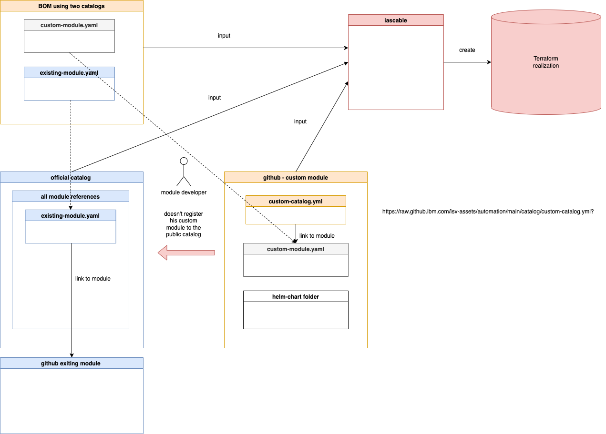
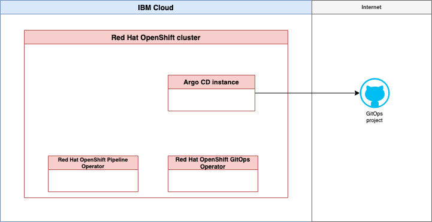
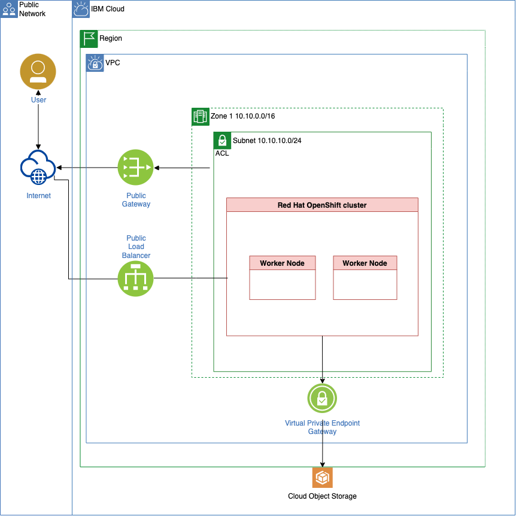
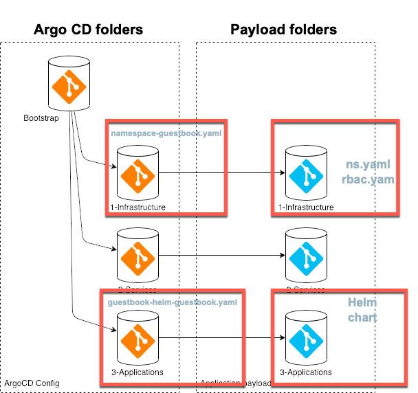
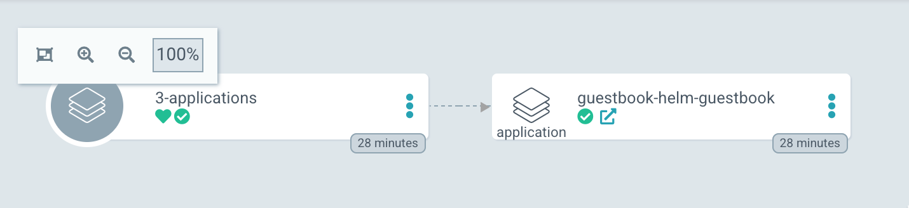
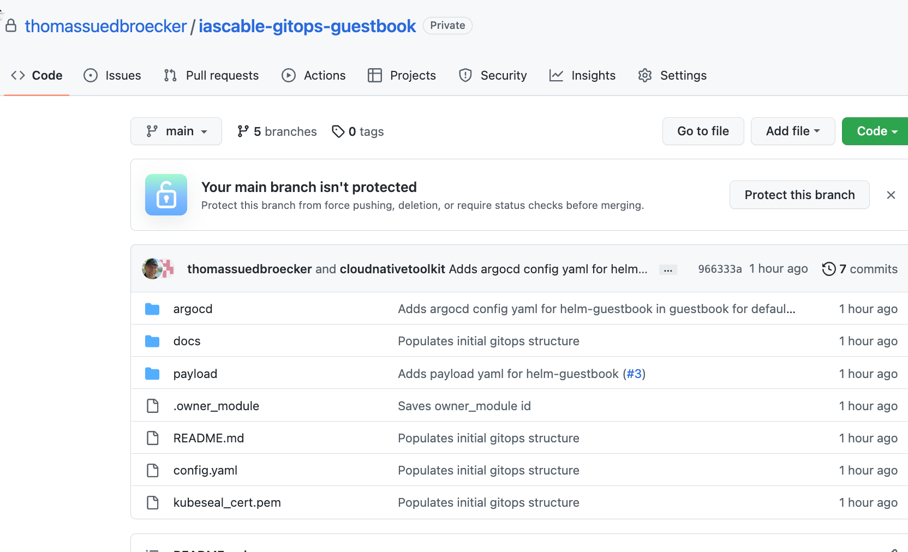
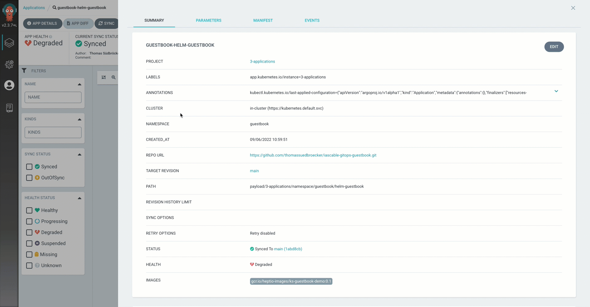

# Overview

## 1. Objective

The objective is to understand how to build new modules for the [`Technology Zone Accelerator Toolkit`](https://modules.cloudnativetoolkit.dev/).

## 2. What does the project do?

This project does inspect the [template-terraform-gitops](https://github.com/cloud-native-toolkit/template-terraform-gitops) and needs to be seen in combination with the [gitops-verify-swagger-editor-example](https://github.com/thomassuedbroecker/gitops-verify-swagger-editor-example) outcome.
The repository documents how to create a module for [`Technology Zone Accelerator Toolkit`](https://modules.cloudnativetoolkit.dev/) `step-by-step` using the [helm guestbook application example](https://github.com/argoproj/argocd-example-apps/tree/master/helm-guestbook) from the Argo CD GitHub repository.

### 2.1 Understand the [template-terraform-gitops](https://github.com/cloud-native-toolkit/template-terraform-gitops)

The [`template-terraform-gitops`](https://github.com/cloud-native-toolkit/template-terraform-gitops) is a part of the `How to` instructions of the [`Technology Zone Accelerator Toolkit`](https://modules.cloudnativetoolkit.dev/). 
The module covers the [GitOps topic](https://modules.cloudnativetoolkit.dev/#/how-to/gitops).

## 3. Use the [template-terraform-gitops](https://github.com/cloud-native-toolkit/template-terraform-gitops) to create a module to deploy the guestbook example

These are the main tasks:

1. Create a GitHub repository based on the `gitops template` from `Software Everywhere`
2. Configure the `guestbook` `module`
3. Create an own `catalog` for the `guestbook` `module`
4. Create a `BOM` (Bill of material) where the `guestbook` `module` is used and create the needed terraform output with `iascable`

We will use later different catalogs here is a simplified view of the depencencies we will have later.



## 3.1 Perpare the environment

### 3.1.1 Create a new GitHub repository based on the `gitops template`

We clone the [`gitops template` repository](https://github.com/cloud-native-toolkit/template-terraform-gitops) to our local computer and we going to create our [`gitops-terraform-guestbook`](https://github.com/thomassuedbroecker/gitops-terraform-guestbook) repository.

#### Step 1: Clone the GitHub [`gitops template` repository](https://github.com/cloud-native-toolkit/template-terraform-gitops) to your local computer and create a new GitHub repository based on that template

You can follow the steps in the [blog post](https://wp.me/paelj4-1yf) to do this.

Then you should have following folderstructure on on computer:

```sh
├── LICENSE
├── README.md
├── main.tf
├── module.yaml
├── outputs.tf
├── scripts
│   └── create-yaml.sh
├── test
│   └── stages
│       ├── stage0.tf
│       ├── stage1-cert.tf
│       ├── stage1-cluster.tf
│       ├── stage1-cp-catalogs.tf
│       ├── stage1-gitops-bootstrap.tf
│       ├── stage1-gitops.tf
│       ├── stage1-namespace.tf
│       ├── stage2-mymodule.tf
│       ├── stage3-outputs.tf
│       └── variables.tf
├── variables.tf
└── version.tf
```

### 3.1.2 Install [`iascable`](https://github.com/cloud-native-toolkit/iascable)

We install  [`iascable`](https://github.com/cloud-native-toolkit/iascable) to ensure you use the lates version.

#### Step 1: Install [`iascable`](https://github.com/cloud-native-toolkit/iascable) on your local computer

```sh
curl -sL https://iascable.cloudnativetoolkit.dev/install.sh | sh
iascable --version
```

* Example output:

```sh
2.17.2
```

### 3.1.2 Install a container engine

In this example we use the unsupport container engine [colima](https://github.com/abiosoft/colima), because that worked for us.

#### Step 1: Install [colima](https://github.com/abiosoft/colima)

```sh
# Homebrew
brew install colima
``` 

## 4. Implement the new `guestbook` module 

In that section we will modify files in our newly created repository. These are the relevant files for our new module.

* The [`main.tf`](https://github.com/thomassuedbroecker/gitops-terraform-guestbook/blob/main/main.tf) file
* The [`variable.tf`](https://github.com/thomassuedbroecker/gitops-terraform-guestbook/blob/main/variables.tf) file
* The [`helm chart`](https://github.com/thomassuedbroecker/gitops-terraform-guestbook/tree/main/chart/helm-guestbook) content
* The [`module.yaml`](https://github.com/thomassuedbroecker/gitops-terraform-guestbook/blob/main/module.yaml) file
* Create for [`gitops-terraform-guestbook` GitHub repository `tags` and `releases`](https://github.com/thomassuedbroecker/gitops-terraform-guestbook/tags)
* Configure the `helm chart` copy automation in the `scripts/create-yaml.sh` file

### 4.1 The [`main.tf`](https://github.com/thomassuedbroecker/gitops-terraform-guestbook/blob/main/main.tf) file

#### Step 1:  Do some modifications in the `main.tf` file

* Change `name = "my-helm-chart-folder"` to `helm-guestbook`

* First add `helm_guestbook = {// create entry}` to the `values_content = {}`. That entry will be used to create the values for the variables in the `values.yaml` file for the helm chart.
  
  Below you see the relevant code in the `main.tf` which does the copy later. As you can is it uses the `{local.name}` value, so you need to ensure the name reflects the folder structure for your `helm-chart` later.

  ```sh
  resource null_resource create_yaml {
    provisioner "local-exec" {
      command = "${path.module}/scripts/create-yaml.sh '${local.name}' '${local.yaml_dir}'"
  
      environment = {
        VALUES_CONTENT = yamlencode(local.values_content)
      }
    }
  }
  ```

  These are the values we need to insert for our guestbook application as variables for the helm-chart. You find the variables in the Argo CD github project for the helm guestbook application [values.yaml](https://github.com/argoproj/argocd-example-apps/blob/master/helm-guestbook/values.yaml)

  Now replace the `// create entry` with the needed values.

```sh
    helm_guestbook = {
      "replicaCount": 1
      "image.repository" = "gcr.io/heptio-images/ks-guestbook-demo"
      "image.tag" = "0.1"
      "image.pullPolicy" = "IfNotPresent"
      "service.type" = "ClusterIP"
      "service.port" = "80"
      "ingress.enabled" = "false"
      "ingress.annotations" = ""
      "ingress.path" = "/"
      "ingress.hosts" = ["chart-example.local"]
      "ingress.tls" = []
      "resources" = ""
      "nodeSelector" = ""
      "tolerations" = ""
      "affinity" = ""
    }
```
  
* Change `layer = "services"` to `layer = "applications"`

* Add `cluster_type = var.cluster_type == "kubernetes" ? "kubernetes" : "openshift"` to the `locals`

```sh
locals {
  name          = "my-helm-chart-folder"
  bin_dir       = module.setup_clis.bin_dir
  yaml_dir      = "${path.cwd}/.tmp/${local.name}/chart/${local.name}"
  service_url   = "http://${local.name}.${var.namespace}"
  values_content = {
    helm_guestbook = {
      // create entry
    }
  }
  layer = "services"
  type  = "base"
  application_branch = "main"
  namespace = var.namespace
  layer_config = var.gitops_config[local.layer]
}
```

### 4.2 The [`variable.tf`](https://github.com/thomassuedbroecker/gitops-terraform-guestbook/blob/main/variables.tf) file

#### Step 1: Add some variables in the [`variable.tf`](https://github.com/thomassuedbroecker/gitops-terraform-guestbook/blob/main/variables.tf) file

```hcl
variable "cluster_type" {
  description = "The cluster type (openshift or kubernetes)"
  default     = "openshift"
}
```

### 4.3 The [`helm chart`](https://github.com/thomassuedbroecker/gitops-terraform-guestbook/tree/main/chart/helm-guestbook) content

#### Step 1: Create a new folder structure for the `guestbook helm chart`

* Create following folder structure `chart/helm-guestbook`.
  The name after chart must be the module name.

```sh
  ├── chart
  │   └── helm-guestbook
  │       ├── Chart.yaml
  │       ├── charts
  │       │   └── helm-guestbook
  │       │       ├── templates
  │       │       │   ├── NOTES.txt
  │       │       │   ├── _helpers.tpl
  │       │       │   ├── deployment.yaml
  │       │       │   └── service.yaml
  │       │       ├── values-production.yaml
  │       │       └── values.yaml
  │       │       └── Chart.yaml
  │       └── values.yaml
```

That will be the resulting folder structure for the `guestbook module` on your local pc:

```sh
├── LICENSE
├── README.md
├── chart
│   └── helm-guestbook
│       ├── Chart.yaml
│       ├── charts
│       │   └── helm-guestbook
│       │       ├── Chart.yaml
│       │       ├── templates
│       │       │   ├── NOTES.txt
│       │       │   ├── _helpers.tpl
│       │       │   ├── deployment.yaml
│       │       │   └── service.yaml
│       │       ├── values-production.yaml
│       │       └── values.yaml
│       └── values.yaml
├── main.tf
├── module.yaml
├── outputs.tf
├── scripts
│   └── create-yaml.sh
├── test
│   └── stages
│       ├── stage0.tf
│       ├── stage1-cert.tf
│       ├── stage1-cluster.tf
│       ├── stage1-cp-catalogs.tf
│       ├── stage1-gitops-bootstrap.tf
│       ├── stage1-gitops.tf
│       ├── stage1-namespace.tf
│       ├── stage2-mymodule.tf
│       ├── stage3-outputs.tf
│       └── variables.tf
├── variables.tf
└── version.tf
```


#### Step 2: Copy in newly create folderstructure the content from the repository for the `helm-guestbook` chart [https://github.com/argoproj/argocd-example-apps/tree/master/helm-guestbook](https://github.com/argoproj/argocd-example-apps/tree/master/helm-guestbook)

#### Step 3: Validate the `helm chart` with following commands:

* Navigate the charts directory

```sh
CHARTDIR=./chart/helm-guestbook/charts/helm-guestbook
cd $CHARTDIR
```

* Verify the dependencies

```sh
helm dep update .
```

* Verify the helm chart structure

```sh
helm lint .
```

Example output:

```sh
==> Linting .
[INFO] Chart.yaml: icon is recommended

1 chart(s) linted, 0 chart(s) failed
```

```sh
helm template test . -n test
```

Example output:

```sh
# Source: helm-guestbook/templates/service.yaml
apiVersion: v1
kind: Service
metadata:
  name: test-helm-guestbook
  labels:
    app: helm-guestbook
    chart: helm-guestbook-0.1.0
    release: test
    heritage: Helm
spec:
  type: ClusterIP
  ports:
    - port: 80
      targetPort: http
      protocol: TCP
      name: http
  selector:
    app: helm-guestbook
    release: test
---
# Source: helm-guestbook/templates/deployment.yaml
apiVersion: apps/v1
kind: Deployment
metadata:
  name: test-helm-guestbook
  labels:
    app: helm-guestbook
    chart: helm-guestbook-0.1.0
    release: test
    heritage: Helm
spec:
  replicas: 1
  revisionHistoryLimit: 3
  selector:
    matchLabels:
      app: helm-guestbook
      release: test
  template:
    metadata:
      labels:
        app: helm-guestbook
        release: test
    spec:
      containers:
        - name: helm-guestbook
          image: "gcr.io/heptio-images/ks-guestbook-demo:0.1"
          imagePullPolicy: IfNotPresent
          ports:
            - name: http
              containerPort: 80
              protocol: TCP
          livenessProbe:
            httpGet:
              path: /
              port: http
          readinessProbe:
            httpGet:
              path: /
              port: http
          resources:
            {}
```

### 4.4 The [`module.yaml`](https://github.com/thomassuedbroecker/gitops-terraform-guestbook/blob/main/module.yaml) file

#### Step 1: Edited the `module.yaml` 

* Use for `name`: `gitops-terraform-guestbook`
* Use for `description`: `That module will add a new Argo CD config to deploy the guestbook application`

```yaml
name: ""
type: gitops
description: ""
tags:
  - tools
  - gitops
versions:
  - platforms:
      - kubernetes
      - ocp3
      - ocp4
    dependencies:
      - id: gitops
        refs:
          - source: github.com/cloud-native-toolkit/terraform-tools-gitops.git
            version: ">= 1.1.0"
      - id: namespace
        refs:
          - source: github.com/cloud-native-toolkit/terraform-gitops-namespace.git
            version: ">= 1.0.0"
    variables:
      - name: gitops_config
        moduleRef:
          id: gitops
          output: gitops_config
      - name: git_credentials
        moduleRef:
          id: gitops
          output: git_credentials
      - name: server_name
        moduleRef:
          id: gitops
          output: server_name
      - name: namespace
        moduleRef:
          id: namespace
          output: name
      - name: kubeseal_cert
        moduleRef:
          id: gitops
          output: sealed_secrets_cert
```

### 4.5 `gitops-terraform-guestbook` GitHub repository `tags` and `releases`

#### Step 1: Create GitHub tag and release for the `gitops-terraform-guestbook` GitHub repository

The module github repository releases should be updated when you are going to change the `gitops-terraform-guestbook` GitHub repository module. In case when you use specific version numbers in the `BOM` which consums the module. That is also relevant for the `catalog.yaml` we will define later.

Example relevant extract from a `BOM` -> `version: v0.0.5`

```yaml
    # Install guestbook
    # New custom module linked be the custom catalog
    - name: gitops-terraform-guestbook
      # alias: gitops-terraform-guestbook
      #  version: v0.0.5
      # variables:
      #  - name: namespace_name
      #    value: "helm-guestbook"
```

You can follow the step to create a GitHub tag is that [example blog post](https://suedbroecker.net/2022/05/09/how-to-create-a-github-tag-for-your-last-commit/) and then create a release.

### 4.6 Configure the `helm chart` copy automation in the `scripts/create-yaml.sh` file

#### Step 1: Configure the `scripts/create-yaml.sh` in `gitops-terraform-guestbook` repository 

Replace the existing code in `scripts/create-yaml.sh` with following content. This is important for later when the `helm-chart` will be copied.

```sh
#!/usr/bin/env bash

SCRIPT_DIR=$(cd $(dirname "$0"); pwd -P)
MODULE_DIR=$(cd "${SCRIPT_DIR}/.."; pwd -P)
CHART_DIR=$(cd "${SCRIPT_DIR}/../chart/helm-guestbook"; pwd -P)

NAME="$1"
DEST_DIR="$2"

## Add logic here to put the yaml resource content in DEST_DIR
mkdir -p "${DEST_DIR}"
cp -R "${CHART_DIR}/"* "${DEST_DIR}"

if [[ -n "${VALUES_CONTENT}" ]]; then
  echo "${VALUES_CONTENT}" > "${DEST_DIR}/values.yaml"
fi
find "${DEST_DIR}" -name "*"
echo "Files in output path"
ls -l "${DEST_DIR}"
```

## 5. Create an own catalog

In that example we will not publish the our `gitops-terraform-guestbook` module to the public catalog on [`Technology Zone Accelerator Toolkit`](https://modules.cloudnativetoolkit.dev/). 

We will create our own `catalog.yaml` file and save the configuration in the GitHub project of the module.

* How to create `catalog.yaml` file?
* How to combine various catalogs?
* Inspect the structure of a `catalog.yaml`
* Create a custom catalog steps


### 5.1 How to create `catalog.yaml` file?

  It is useful to take a look into [iascable documentation](https://github.com/cloud-native-toolkit/iascable) and the [build-catalog.sh automation](https://github.com/cloud-native-toolkit/software-everywhere/blob/main/.github/scripts/build-catalog.sh).

### 5.2 How to combine various catalogs?

  You can combine more than one `catalog resources` and `BOM inputs` with the `iascable build` command.

  Here is the build command:

  ```sh
  iascable build [-c {CATALOG_URL}] [-c {CATALOG_URL}] -i {BOM_INPUT} [-i {BOM_INPUT}] [-o {OUTPUT_DIR}]
  ```

  * `CATALOG_URL` is the url of the module catalog. The default module catalog is https://modules.cloudnativetoolkit.dev/index.yaml. Multiple module catalogs can be provided. The catalogs are combined, with the last one taking precedence in the case of duplicate modules.
  * `BOM_INPUT` is the input file containing the Bill of Material definition. Multiple BOM files can be provided at the same time.
  * `OUTPUT_DIR` is the directory where the output terraform template will be generated.

### 5.3 Inspect the structure of a `catalog.yaml`

  The structure of a catalog can be verified here
  [https://modules.cloudnativetoolkit.dev/index.yaml](https://modules.cloudnativetoolkit.dev/index.yaml)
  That is a minimize extraction of the `index.yaml` above. It contains: `categories`,`modules`,`aliases` and `providers`.

  ```yaml
  apiVersion: cloudnativetoolkit.dev/vlalphal
  kind: Catalog
  categories:
    - category: ai-ml
    - category: cluster
    - category: databases
    - category: dev-tool
    - category: gitops
      categoryName: GitOps
      selection: multiple
      modules:
        - cloudProvider: ""
          softwareProvider: ""
          type: gitops
          name: gitops-ocs-operator
          description: Module to populate a gitops repo with the resources to provision ocs-operator
          tags:
            - tools
            - gitops
          versions: []
          id: github.com/cloud-native-toolkit/terraform-gitops-ocs-operator
          group: ""
          displayName: ocs-operator
    - category: iam
    - category: image-registry
    - category: infrastructure
    ...
  aliases:
    - id: github.com/terraform-ibm-modules/terraform-ibm-toolkit-mongodb
    ...
  providers:
    - name: ibm
      source: ibm-cloud/ibm
      variables:
        - name: ibmcloud_api_key
          scope: global
        - name: region
          scope: global
  ```

### 5.4 Inspect the module section of the catalog file in more detail

  We see that the `modules section` does contain following `cloudProvider`, `softwareProvider`, `id`, `group`, `displayName` and `type` which are not a part of the `module.yaml`. After these entries we insert content of the `module.yaml`.

  [Current `gitops` template](https://github.com/cloud-native-toolkit/template-terraform-gitops).

### 5.5 Create a custom catalog

#### Step 1: Create a `guestbook-catalog.yml` and insert following content

> Note: Ensure that the github project has a tag and a release!

**The right value of the release** must be reference in the catalog! (Example `version: v0.0.1`).

  ```yaml
  apiVersion: cloudnativetoolkit.dev/v1alpha1
  kind: Catalog
  categories:
    - category: custom_module
      categoryName: custom_module
      selection: multiple
      modules:
        - cloudProvider: ""
          softwareProvider: ""
          type: gitops
          id: github.com/thomassuedbroecker/gitops-terraform-guestbook
          group: ""
          displayName: gitops-terraform-guestbook
          name: gitops-terraform-guestbook
          description: asdf
          tags:
            - tools
            - gitops
          versions:
            - platforms:
                - kubernetes
                - ocp3
                - ocp4
              dependencies:
                - id: gitops
                  refs:
                    - source: github.com/cloud-native-toolkit/terraform-tools-gitops.git
                      version: '>= 1.1.0'
              variables:
                - name: gitops_config
                  description: Config information regarding the gitops repo structure
                  moduleRef:
                    id: gitops
                    output: gitops_config
                - name: git_credentials
                  description: The credentials for the gitops repo(s)
                  sensitive: true
                  moduleRef:
                    id: gitops
                    output: git_credentials
                - name: namespace
                  type: string
                  description: The namespace where the application should be deployed
                  moduleRef:
                    id: namespace
                    output: name
                - name: kubeseal_cert
                  type: string
                  description: The certificate/public key used to encrypt the sealed secrets
                  default: ""
                  moduleRef:
                    id: gitops
                    output: sealed_secrets_cert
                - name: server_name
                  type: string
                  description: The name of the server
                  default: default
                  moduleRef:
                    id: gitops
                    output: server_name
              version: v0.0.1
              outputs:
                - name: name
                  description: The name of the module
                - name: branch
                  description: The branch where the module config has been placed
                - name: namespace
                  description: The namespace where the module will be deployed
                - name: server_name
                  description: The server where the module will be deployed
                - name: layer
                  description: The layer where the module is deployed
                - name: type
                  description: The type of module where the module is deployed
  ```

### 5.6. `BOM` that we will use `guestbook module`

#### Step 1: Clone the project with the example [`BOM`](https://github.com/thomassuedbroecker/gitops-create-software-everywhere-module/blob/main/example/ibm-vpc-roks-argocd-guestbook.yaml) configuration 

```sh
git clone https://github.com/thomassuedbroecker/gitops-create-software-everywhere-module
```

#### Step 2: Verify the [`ibm-vpc-roks-argocd-guestbook.yaml`](https://github.com/thomassuedbroecker/gitops-create-software-everywhere-module/blob/main/example/ibm-vpc-roks-argocd-guestbook.yaml) `BOM` file

This is the simplified target architecture what our  `BOM` will create as terraform code for initial setup.

A customized IBM Cloud environment for `GitOps` and our `guestbook` module.

* For the configuration of GitOps in Red Hat OpenShift. We will use two operators:

  * [Red Hat OpenShift GitOps operator](https://github.com/redhat-developer/gitops-operator)

    We will create one ArgoCD instance with the Red at OpenShift GitOps operator, that ArgoCD instance will bin initial configured by a newly created GitHub project configure by a Cloud Native Toolkit template for GitOps repositories.

  * [Red Hat OpenShift Pipelines operator](https://catalog.redhat.com/software/operators/detail/5ec54a4628834587a6b85ca5)

    There will be no initial setup for a Tekton pipeline at the moment.
 
  That images show a simplified view of the Argo CD basic configuration.

  

* IBM Cloud infrastructure with Red Hat OpenShift in a Virtual Private Cloud
   
   

This is the structure of the `BOM` we are going to use: 

* Virtual Private Cloud - related
* ROKS - related (RedHat OpenShift on IBM Cloud)
* GitOps and Bootstrap of GitOps 
* Our own module called `gitops-terraform-guestbook`

> Note: You need configure variables to your needs, when you share your IBM Cloud environment with others. 

We commented out the `#  version: v0.0.5` of our module, because we will configure only one version in our `catalog.yaml` which we will define later.

```yaml
apiVersion: cloudnativetoolkit.dev/v1alpha1
kind: BillOfMaterial
metadata:
  name: ibm-vpc-roks-argocd-guestbook
spec:
  modules:
    # Virtual Private Cloud - related
    # - subnets
    # - gateways
    - name: ibm-vpc
      alias: ibm-vpc
      version: v1.16.1
      variables:
      - name: name
        value: "tsued-gitops-guestbook"
      - name: tags
        value: ["tsuedro"]
    - name: ibm-vpc-subnets
      alias: ibm-vpc-subnets
      version: v1.13.2
      variables:
        - name: _count
          value: 1
        - name: name
          value: "tsued-gitops-guestbook"
        - name: tags
          value: ["tsuedro"]
    - name: ibm-vpc-gateways
    # ROKS - related
    # - objectstorage
    - name: ibm-ocp-vpc
      alias: ibm-ocp-vpc
      version: v1.15.7
      variables:
        - name: name
          value: "tsued-gitops-guestbook"
        - name: worker_count
          value: 2
        - name: tags
          value: ["tsuedro"]
    - name: ibm-object-storage
      alias: ibm-object-storage
      version: v4.0.3
      variables:
        - name: name
          value: "cos_tsued_guestbook"
        - name: tags
          value: ["tsuedro"]
        - name: label
          value: ["cos_tsued_guestbook"]
    # Install OpenShift GitOps and Bootstrap GitOps (aka. ArgoCD) - related
    # - argocd
    # - gitops
    - name: argocd-bootstrap
      alias: argocd-bootstrap
      version: v1.12.0
      variables:
        - name: repo_token
    - name: gitops-repo
      alias: gitops-repo
      version: v1.20.2
      variables:
        - name: host
          value: "github.com"
        - name: type
          value: "GIT"
        - name: org
          value: "thomassuedbroecker"
        - name: username
          value: "thomassuedbroecker"
        - name: project
          value: "iascable-gitops-guestbook"
        - name: repo
          value: "iascable-gitops-guestbook"
    # Install guestbook
    # New custom module linked be the custom catalog
    - name: gitops-terraform-guestbook
      #  alias: gitops-terraform-guestbook
      #  version: v0.0.5
      variables:
        - name: namespace
          value: "helm-guestbook"
```

## 6. Create terraform code and create the resources

Use [`iascable`](https://github.com/cloud-native-toolkit/iascable) to create the terraform code

#### Step 1: Update helper scripts

The helper scripts are not a part of the framework, the will just help to avoid failures during the execution of several command.

```sh
cd example
ls
```

These are the helper scripts:

  * [helper-create-scaffolding.sh](https://github.com/thomassuedbroecker/gitops-create-software-everywhere-module/blob/main/example/helper-create-scaffolding.sh)                          
  * [helper-tools-create-container-workspace.sh](https://github.com/thomassuedbroecker/gitops-create-software-everywhere-module/blob/main/example/helper-tools-create-container-workspace.sh)          
  * [helper-tools-execute-apply-and-backup-result.sh](https://github.com/thomassuedbroecker/gitops-create-software-everywhere-module/blob/main/example/helper-tools-execute-apply-and-backup-result.sh)       
  * [helper-tools-execute-destroy-and-delete-backup.sh](https://github.com/thomassuedbroecker/gitops-create-software-everywhere-module/blob/main/example/helper-tools-execute-destroy-and-delete-backup.sh)

* Update helper script `helper-create-scaffolding.sh` with following code that uses two catalog files as input for the terraform creation with `iascable`.

```sh
BASE_CATALOG=https://modules.cloudnativetoolkit.dev/index.yaml
CUSTOM_CATALOG=https://raw.githubusercontent.com/thomassuedbroecker/gitops-terraform-guestbook/main/guestbook-catalog.yml

# 1. Create scaffolding
iascable build -i ibm-vpc-roks-argocd-guestbook.yaml -c $BASE_CATALOG -c $CUSTOM_CATALOG
```

#### Step 2: Execute ["helper-create-scaffolding.sh"](https://github.com/thomassuedbroecker/gitops-create-software-everywhere-module/blob/main/example/helper-create-scaffolding.sh)

```sh
sh helper-create-scaffolding.sh 
```

That script ["helper-create-scaffolding.sh"](https://github.com/thomassuedbroecker/gitops-create-software-everywhere-module/blob/main/example/helper-create-scaffolding.sh) does following steps:

1. Basic global variables
2. Create scaffolding (execute iascable)
3. Copy helper bash scripts
4. Navigate to the output folder
5. Start the container engine

#### Step 3: Delete the `-u "${UID}" \` command from the `output/launch.sh` script

```sh
${DOCKER_CMD} run -itd --name ${CONTAINER_NAME} \
  --device /dev/net/tun --cap-add=NET_ADMIN \
  -u "${UID}" \
  -v "${SRC_DIR}:/terraform" \
  -v "workspace-${AUTOMATION_BASE}:/workspaces" \
  ${ENV_VARS} -w /terraform \
  ${DOCKER_IMAGE}
```

#### Step 4: Start the `launch.sh script`

```sh
cd output
sh launch.sh
```

#### Step 5: Execute in the `tools container` the ["helper-tools-create-container-workspace.sh"](https://github.com/thomassuedbroecker/gitops-create-software-everywhere-module/blob/main/example/helper-tools-create-container-workspace.sh) script

```sh
/terraform $
```

```sh
sh helper-tools-create-container-workspace.sh 
```

That script ["helper-tools-create-container-workspace.sh"](https://github.com/thomassuedbroecker/gitops-create-software-everywhere-module/blob/main/example/helper-tools-create-container-workspace.sh) does following steps inside the tools container:

1. Basic global variables
2. Create a workspace folder
3. Copy content of the mapped volume to the newly created the workspace folder
4. Navigate to the workspace folder

#### Step 6: Execute in the `tools container` the ["helper-tools-execute-apply-and-backup-result.sh"](https://github.com/thomassuedbroecker/gitops-create-software-everywhere-module/blob/main/example/helper-tools-execute-apply-and-backup-result.sh) script

```sh
/terraform $
```

```sh
sh helper-tools-execute-apply-and-backup-result.sh 
```

That script ["helper-tools-execute-apply-and-backup-result.sh"](https://github.com/thomassuedbroecker/gitops-create-software-everywhere-module/blob/main/example/helper-tools-execute-apply-and-backup-result.sh) does following steps inside the tools container:

1. Basic global variables
2. Navigate to workspace
3. Execute apply.sh
4. List the created resources
5. Copy current of the workspace folder to mapped volume

Interactive output:

* Namespace: guestbook
* Region: eu-de
* Resource group: default

```sh
Provide a value for 'gitops-repo_host':
  The host for the git repository. The git host used can be a GitHub, GitHub Enterprise, Gitlab, Bitbucket, Gitea or Azure DevOps server. If the host is null assumes in-cluster Gitea instance will be used.
> (github.com) 
Provide a value for 'gitops-repo_org':
  The org/group where the git repository exists/will be provisioned. If the value is left blank then the username org will be used.
> (thomassuedbroecker) 
Provide a value for 'gitops-repo_project':
  The project that will be used for the git repo. (Primarily used for Azure DevOps repos)
> (iascable-gitops-guestbook) 
Provide a value for 'gitops-repo_username':
  The username of the user with access to the repository
> (thomassuedbroecker) 
Provide a value for 'gitops-repo_token':
> XXX
> Provide a value for 'ibmcloud_api_key':
> XXX
Provide a value for 'region':
> eu-de
Provide a value for 'worker_count':
  The number of worker nodes that should be provisioned for classic infrastructure
> (2) 
Provide a value for 'ibm-ocp-vpc_flavor':
  The machine type that will be provisioned for classic infrastructure
> (bx2.4x16) 
Provide a value for 'ibm-vpc-subnets__count':
  The number of subnets that should be provisioned
> (1) 
Provide a value for 'namespace_name':
  The value that should be used for the namespace
> guestbook
Provide a value for 'resource_group_name':
  The name of the resource group
> default
```

#### Step 7: Verify the output of terraform execution

After some time you should get following output:

```sh
Apply complete! Resources: 103 added, 0 changed, 0 destroyed.
```

## 7. Verify the created Argo CD configuration on GitHub

We see that in our GitHub account new repostory was created from the [GitOps bootstap module](https://github.com/cloud-native-toolkit/terraform-util-gitops-bootstrap) and the [terraform-tools-gitops](https://github.com/cloud-native-toolkit/terraform-tools-gitops/tree/main/template) module to figure `Argo CD` for by using the `app-of-apps` concept with a single GitHub repository to manage all `Argo CD application configuration` and `helm configurations to deploy applications` in the GitOps context.

> Reminder the boot strap configuration is shown in the following image for details visit the [terraform-tools-gitops](https://github.com/cloud-native-toolkit/terraform-tools-gitops/tree/main/template) module.


The new GitHub repository is called `iascable-gitops-guestbook` in our case.

The new `iascable-gitops-guestbook` repository contains two folders the following image shows the relation to the bootstrap configuration.



* **argocd** folder which contains the configuration for `Argo CD` let us call it **app-of-apps** folder. The following image displays the resulting configuration in `Argo CD`



* **payload** folder which contains the current helm deployment for the **apps** which will be deployed. The following image show the deployment created by `apps` in our case the helm-guestbook 

The following image shows the newly created GitHub `iascable-gitops-guestbook` repository.



For more details visit the template of the [terraform-tools-gitops](https://github.com/cloud-native-toolkit/terraform-tools-gitops/tree/main/template) module.


### 7.1 Understand how the `guestbook module content` was pasted into the new `iascable-gitops-guestbook` repository

Following the concept for the gitops bootstrap setup documented in the [template-terraform-gitops](https://github.com/cloud-native-toolkit/template-terraform-gitops) GitHub repository.

We have two main folders in the `iascable-gitops-guestbook` repository.

1. One for the `Argo CD application` configurations called `argocd`
2. One for the application which will be deployed be the `Argo CD application` configurations called payload.

Let us inspect these two folders. The `gif` below shows some of the created files and folders.


#### 7.1.1 `argocd` folder

There were two `Argo CD application` configurations added into the `iascable-gitops-guestbook` repository. 

1. One for the `namespace` in the OpenShift or Kubernetes cluster where the guestbook application will be deployed. That `Argo CD application` configuration is related to exiting  `1-infrastructure` Argo CD project created by the [GitOps bootstap module](https://github.com/cloud-native-toolkit/terraform-util-gitops-bootstrap).

2. One for the `guestbook` application we want to deploy. That `Argo CD application` configuration is related to exiting  `3-application` Argo CD project created by the [GitOps bootstap module](https://github.com/cloud-native-toolkit/terraform-util-gitops-bootstrap).

Let's take a look a the created `Argo CD application configurations`

We have two `Argo CD` application configurations:

#### 7.1.1.1 Guestbook **Namespace** in `argocd.1-infrastructure.cluster.default.base.namespace.yaml`

```yaml
apiVersion: argoproj.io/v1alpha1
kind: Application
metadata:
  name: namespace-guestbook
  finalizers:
    - resources-finalizer.argocd.argoproj.io
spec:
  destination:
    namespace: default
    server: https://kubernetes.default.svc
  project: 1-infrastructure
  source:
    path: payload/1-infrastructure/namespace/guestbook/namespace
    repoURL: https://github.com/thomassuedbroecker/iascable-gitops-guestbook.git
    targetRevision: main
  syncPolicy:
    automated:
      prune: true
      selfHeal: true
  ignoreDifferences: []
```

#### 7.1.1.2 Guestbook **application deployment** `argocd.3-applications.cluster.default.base.guestbook-helm-guestbook.yaml`

This is the Argo CD application configuration `guestbook-helm-guestbook.yaml` file, which was created automaticly by our module with the `igc gitops-module` command.

That `payload` directory is used as the `source.path` in that `Argo CD application` configuration as you see above.

```yaml
apiVersion: argoproj.io/v1alpha1
kind: Application
metadata:
  name: guestbook-helm-guestbook
  finalizers:
    - resources-finalizer.argocd.argoproj.io
spec:
  destination:
    namespace: guestbook
    server: https://kubernetes.default.svc
  project: 3-applications
  source:
    path: payload/3-applications/namespace/guestbook/helm-guestbook
    repoURL: https://github.com/thomassuedbroecker/iascable-gitops-guestbook.git
    targetRevision: main
    helm:
      releaseName: helm-guestbook
  syncPolicy:
    automated:
      prune: true
      selfHeal: true
  ignoreDifferences: []
```

#### 7.1.2 `payload` folder

That folder contains a `namespace` payload and the `helm-chart` payload. 

#### 7.1.2.2 Guestbook **Namespace** in `payload.1-infrastructure.cluster.default.base`

In the folder `payload.1-infrastructure.cluster.default.base` we have an `ns.yaml` and `rbac.yaml`. 

* `ns.yaml`

```yaml
apiVersion: v1
kind: Namespace
metadata:
  name: guestbook
  annotations:
    argocd.argoproj.io/sync-wave: "-30"
---
apiVersion: operators.coreos.com/v1
kind: OperatorGroup
metadata:
  name: guestbook-operator-group
  namespace: guestbook
  annotations:
    argocd.argoproj.io/sync-wave: "-20"
spec:
  targetNamespaces:
    - guestbook
---
```

* `rbac.yaml`

```yaml
apiVersion: rbac.authorization.k8s.io/v1
kind: Role
metadata:
  name: argocd-admin
  namespace: guestbook
  annotations:
    argocd.argoproj.io/sync-wave: "-20"
rules:
- apiGroups:
  - "*"
  resources:
  - "*"
  verbs:
  - "*"
---
apiVersion: rbac.authorization.k8s.io/v1
kind: RoleBinding
metadata:
  name: argocd-admin
  namespace: guestbook
  annotations:
    argocd.argoproj.io/sync-wave: "-20"
roleRef:
  apiGroup: rbac.authorization.k8s.io
  kind: Role
  name: argocd-admin
subjects:
- apiGroup: rbac.authorization.k8s.io
  kind: Group
  name: system:serviceaccounts:openshift-gitops
```

> Note: This configuration is reposible that our initial deployment of the guestbook application does run in a permission problem. Because we are not allowed to bind port **:80** with the permission in that namespace (OpenShift project).

```sh
AH00558: apache2: Could not reliably determine the server's fully qualified domain name, using 172.17.5.168. Set the 'ServerName' directive globally to suppress this message
(13)Permission denied: AH00072: make_sock: could not bind to address [::]:80
(13)Permission denied: AH00072: make_sock: could not bind to address 0.0.0.0:80
no listening sockets available, shutting down
AH00015: Unable to open logs
```

#### 7.1.1.2 Guestbook helm **application deployment** `payload.3-applications.cluster.default.base`


That folder contains the **Guestbook application** `helm chart configuration` to deploy the guestbook application.

The script `scripts/create-yaml.sh` of our [module `gitops-terraform-guestbook`](https://github.com/thomassuedbroecker/gitops-terraform-guestbook/blob/main/scripts/create-yaml.sh) was resposible to copy the guestbook helm-chart into the payload directory. Therefor we did the customization of that file.

We defined the values content for the helm chart variables before in the `module.tf` file. That file `values.yaml` file is used in `Argo CD application` configuration for the parameters.

```sh
  values_content = {
    helm_guestbook = {
      // create entry
    }
  }
```

The following gif shows the relation of the configuration.




